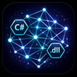

# CSharpDllGraph

<p align="center">
  
</p>

<p align="center">
  <strong>Understand your .NET codebase at a glance.</strong><br/>
  Static dependency analysis and interactive graph visualization for .NET solutions.
</p>

---

CSharpDllGraph scans your `.sln` or `.slnx` file and builds a queryable graph of your entire solution — projects, packages, symbols, and HTTP routes — without running your code.

Use it from the **CLI** to explore and visualize dependencies, or plug it into your **AI assistant** as an MCP server to answer questions about your codebase in real time.

## Why this exists

AI coding assistants are great at reasoning about code — but they struggle with NuGet packages. When a package is poorly documented, internal, or just not well-known, the assistant has no reliable way to understand what it can do without fetching and parsing the package contents on every request. That's slow, unreliable, and often impossible for private packages.

A related problem: online documentation almost always describes the latest version of a package, but real projects pin older versions. When an API changed between versions, the docs mislead more than they help — and finding version-specific documentation is often a dead end.

CSharpDllGraph solves both problems by pre-analyzing your solution and exposing the results as an MCP server. Your AI assistant can then answer questions about projects and packages instantly, based on the exact versions your solution actually uses — not whatever is current on NuGet.org. This is especially useful for internal NuGet packages or large solutions where the dependency graph isn't obvious from filenames alone.

> **Note:** This project contains no AI itself. All the code was written by AI (Claude), but the tool it produces is purely static analysis — no models, no inference, no external calls.

## What you get

- **Interactive graph** — a force-directed HTML visualization of your solution, ready to open in any browser
- **Dependency queries** — list what depends on what, across projects and NuGet packages
- **Version conflict detection** — find packages pulled in at multiple versions
- **Symbol usage lookup** — see where any type or method is used across the solution
- **HTTP call tracing** — trace a route through controllers, services, and repositories
- **AI integration** — expose all queries as MCP tools so Claude, Kiro, Codex, or any MCP-compatible assistant can reason about your code

## Requirements

- .NET 10 SDK
- Windows, macOS, or Linux
- A `.sln` or `.slnx` file in your workspace

## Getting started

**Clone and build:**

```bash
git clone https://github.com/your-org/CSharpDllGraph
cd CSharpDllGraph
dotnet build CSharpDllGraph.slnx
```

**Build the graph for your solution:**

```bash
dotnet run --project src/CSharpDllGraph.Cli -- build /path/to/your/solution --name myproject
```

**Open the visualization:**

After the build, open `.csharpdllgraph/graph.html` in your browser. No web server needed.

**Run a query:**

```bash
dotnet run --project src/CSharpDllGraph.Cli -- query list_dependencies --workspace myproject
```

## CLI reference

| Command | Description |
|---|---|
| `build <path>` | Build a graph from a solution |
| `update <path>` | Rebuild an existing graph |
| `watch <path>` | Watch for changes and rebuild incrementally |
| `query <tool> --workspace <path>` | Run a query against a workspace |

Show all options:

```bash
dotnet run --project src/CSharpDllGraph.Cli -- help
```

## Graph visualization

Every `build` or `update` writes `.csharpdllgraph/graph.html` to your workspace root.

- Filter nodes and edges by type using the filter panel
- Click any node to inspect its attributes and source locations
- Search to highlight matching nodes

## MCP server

The MCP server exposes the full query layer over stdio so AI assistants can reason about your solution. It is **read-only** and never modifies your code.

**Start the server:**

```bash
dotnet run --project src/CSharpDllGraph.Mcp -- --workspace-path /path/to/your/solution
```

On first run, the server builds the graph automatically. Embedded file watching keeps it fresh afterwards — no manual rebuild needed.

**Available MCP tools:**

| Tool | Description |
|---|---|
| `describe_package_api` | Inspect the public API of a NuGet package |
| `list_dependencies` | List project and package dependencies |
| `find_version_conflicts` | Detect packages used at multiple versions |
| `find_usages` | Find all usages of a symbol across the solution |
| `suggest_usage` | Get canonical usage examples for a symbol |
| `trace_http_call` | Trace an HTTP route through the codebase |
| `ping` | Health check |

## Connect to your AI assistant

### Claude Code

```bash
claude mcp add --scope project csharpdllgraph -- dotnet run --project /path/to/CSharpDllGraph/src/CSharpDllGraph.Mcp --
```

Or add to `.mcp.json` in your project root:

```json
{
  "mcpServers": {
    "csharpdllgraph": {
      "command": "dotnet",
      "args": [
        "run",
        "--project",
        "/path/to/CSharpDllGraph/src/CSharpDllGraph.Mcp",
        "--",
        "--workspace-path",
        "/path/to/your/solution"
      ]
    }
  }
}
```

### Kiro

Add to `.kiro/settings/mcp.json`:

```json
{
  "mcpServers": {
    "csharpdllgraph": {
      "command": "dotnet",
      "args": [
        "run",
        "--project",
        "/path/to/CSharpDllGraph/src/CSharpDllGraph.Mcp",
        "--",
        "--workspace-path",
        "/path/to/your/solution"
      ],
      "env": {}
    }
  }
}
```

### Codex

```bash
codex mcp add csharpdllgraph -- dotnet run --project /path/to/CSharpDllGraph/src/CSharpDllGraph.Mcp --
```

Or add to `~/.codex/config.toml`:

```toml
[mcp_servers.csharpdllgraph]
command = "dotnet"
args = ["run", "--project", "/path/to/CSharpDllGraph/src/CSharpDllGraph.Mcp", "--"]
```

## Per-project configuration

Drop a `.csharpdllgraph.json` file in your solution root to avoid passing flags every time:

```json
{
  "workspacePath": "/path/to/your/solution",
  "graphPath": ".csharpdllgraph/graph",
  "solutionPath": "YourSolution.slnx"
}
```

The MCP server and CLI will find this file automatically. Command-line flags take precedence if both are present.

## Publish standalone binaries

For faster startup, publish self-contained binaries instead of using `dotnet run`:

```bash
dotnet publish src/CSharpDllGraph.Cli -c Release -o .artifacts/cli
dotnet publish src/CSharpDllGraph.Mcp -c Release -o .artifacts/mcp
```

Then point your MCP client config to the published executable.

## Recommended `.gitignore` patterns

Add these to your solution's `.gitignore` to avoid committing generated graph data and build cache:

```gitignore
# CSharpDllGraph — generated graph data and build cache
.csharpdllgraph/
.artifacts/
```

## Known issues

- **MCP tool requires multiple re-enables on large solutions** — if your solution references a large number of NuGet packages, the MCP server may time out during initial graph construction. The AI assistant will report the tool as unavailable. Re-enable the tool in your assistant's settings and retry; it may take two or three attempts before the graph is fully built and the server is responsive.
